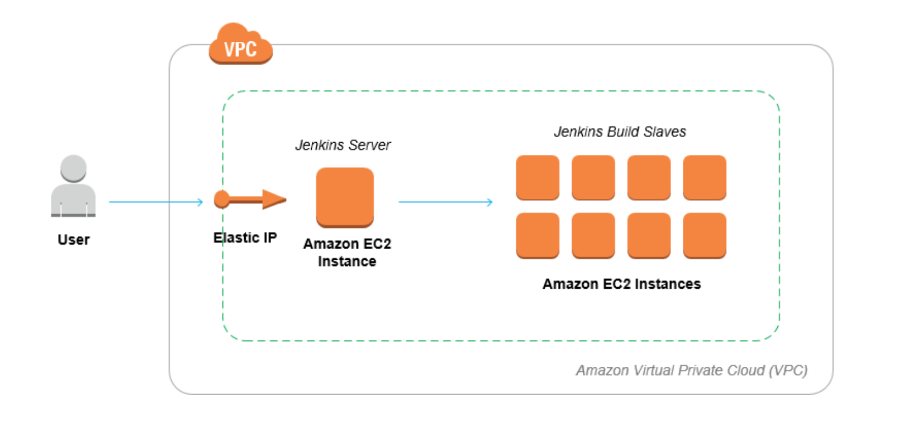

# Jenkins on AWS EC2

What is [Jenkins](https://jenkins.io/doc/).

Jenkins is a self-contained, open source automation server which can be used to automate all sorts of tasks related to building, testing, and delivering or deploying software.

Jenkins can be installed through native system packages, Docker, or even run standalone by any machine with a Java Runtime Environment (JRE) installed.


## Setup

-




## Manual Deployment

Install Oracle Java 8
```bash
> sudo add-apt-repository ppa:webupd8team/java
> sudo apt-get update && sudo apt-get install oracle-java8-installer
> java -version

java version "1.8.0_91"
Java(TM) SE Runtime Environment (build 1.8.0_91-b14)
Java HotSpot(TM) 64-Bit Server VM (build 25.91-b14, mixed mode)
```

Install Jenkins
```bash
> wget -q -O - https://jenkins-ci.org/debian/jenkins-ci.org.key | sudo apt-key add -
> sudo sh -c 'echo deb http://pkg.jenkins-ci.org/debian-stable binary/ > /etc/apt/sources.list.d/jenkins.list'
> sudo apt-get update
> sudo apt-get upgrade
> sudo apt-get install jenkins
> sudo service jenkins start
```

Nginx Proxy
```bash
> sudo apt-get install nginx
> cd /etc/nginx/sites-available
> sudo vi jenkins

```bash
server {
   listen 80;

   server_name elastic.ip.address jenkins.server.tld

   access_log /var/log/nginx/jenkins/access.log;
   error_log  /var/log/nginx/jenkins/error.log info;

   location / {
      include /etc/nginx/proxy_params;
      proxy_pass http://localhost:8080;
      proxy_read_timeout 90s;
   }
}

#create the logs folder
sudo mkdir -p /var/log/nginx/jenkins}/

# remove default and add the jenkins site
sudo rm /etc/nginx/sites-enabled/default

# enable an nginx site with a syslink
sudo ln -s /etc/nginx/sites-available/jenkins /etc/nginx/sites-enabled/

# restart nginx
sudo nginx -t
sudo service nginx restart
sudo service jenkins restart
```
